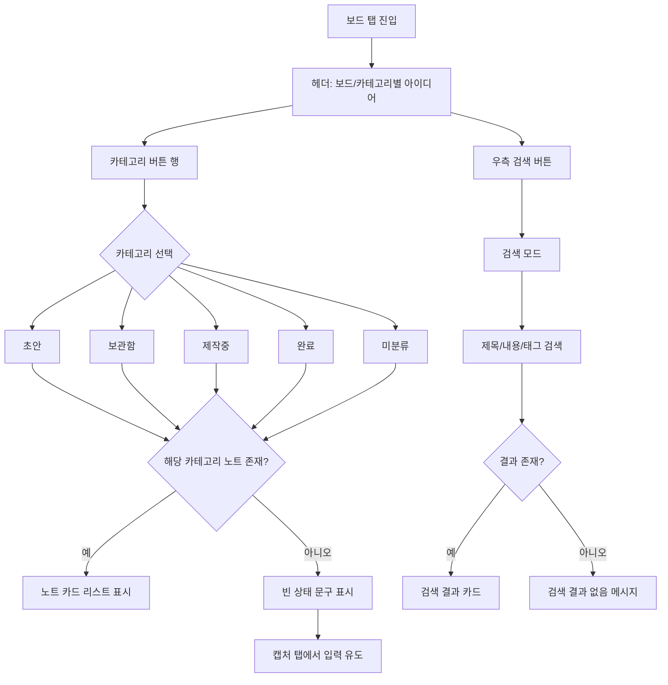

# Linky User Flow (개발 공유용)

이 문서는 현재 구현된 Linky 앱 기준 사용자 흐름을 팀 내 공유/의사소통용으로 정리한 문서입니다.  
아래 `스크린샷 기준 보드 플로우`는 실제 캡처 화면(보드 탭) 상태를 기준으로 작성했습니다.

## 0) 스크린샷 기준 보드 플로우



### 스크린샷 기준 UI 해석

- 상단: `보드` 타이틀 + `카테고리별 아이디어` 서브타이틀
- 중단: `초안/보관함/제작중/완료/미분류` 카테고리 버튼 라인
- 하단: 선택 카테고리 결과 영역
  - 데이터 없음: 아이콘 + "아이디어가 없어요" + 캡처 탭 유도 문구
  - 데이터 있음: 노트 카드 목록
- 우측 검색 버튼: 검색 모드로 전환

## 1) 전체 사용자 여정

```mermaid
flowchart TD
    A[앱 실행] --> B[Capture 탭 진입]
    B --> C{기존 아이디어/메시지 존재?}
    C -- 아니오 --> D[Empty State 노출]
    C -- 예 --> E[채팅+노트 피드 노출]

    D --> F[첫 아이디어 입력 CTA]
    D --> G[헤더 스파클 클릭]
    G --> H[Onboarding 3-Step]
    H --> I[건너뛰기/완료 후 탭 화면 복귀]

    F --> J[IdeaFormSheet 오픈]
    E --> J
    J --> K[제목/내용/태그 입력]
    K --> L[저장]
    L --> M[노트 생성]
    M --> N[Board 탭에서 카테고리별 확인]

    E --> O[마이크 버튼 토글]
    E --> P[메시지 전송(sendMessage)]
    P --> Q[AI 처리(processIdea)]
    Q --> R[AI 응답 메시지 + 노트 자동 저장]
    R --> N

    N --> S[카테고리 칩 선택]
    S --> T[선택 카테고리 리스트 필터링]
    N --> U[검색 모드 진입]
    U --> V[제목/내용/태그 검색 결과]

    N --> W[Settings 탭 이동]
    W --> X[카테고리 추가/삭제]
    X --> Y[Board/Capture에 카테고리 반영]
```

## 2) 탭 기준 상세 흐름

### Capture 탭 (`app/(tabs)/index.tsx`)

- 첫 진입 시 데이터가 없으면 Empty State + 핵심 가치(파생 아이디어/SEO/자동분류) 노출
- `첫 아이디어 입력` 또는 하단 `InputBar` 클릭 시 `IdeaFormSheet` 열림
- 메시지 전송 경로:
  - 사용자 메시지 추가
  - `processIdea()` 호출
  - 카테고리 결정(사용자 선택 > AI 추천 > 기본 카테고리)
  - 노트 저장 + AI 응답 메시지 추가
- 헤더 우측 스파클 버튼으로 온보딩 화면 진입

### Board 탭 (`app/(tabs)/board.tsx`)

- 상단 카테고리 버튼으로 즉시 필터
- 미분류(`__uncategorized__`) 별도 진입점 제공
- 검색 모드:
  - 제목/원문/태그 통합 검색
  - 쿼리 없을 때 힌트 화면
- 결과 없음 상태와 기본 상태(empty) 분기 처리

### Settings 탭 (`app/(tabs)/settings.tsx`)

- 카테고리 목록 조회
- 카테고리 추가(이름/색상/아이콘)
- 기본 카테고리 외 항목 삭제 가능
- 삭제 시 해당 카테고리 아이디어는 미분류로 취급

### Onboarding (`app/onboarding.tsx`)

- 3단계 소개(입력 → AI 구조화 → 제작 연결)
- `다음`, `건너뛰기`, `링키 시작하기`로 메인 탭 복귀

## 3) 상태/데이터 흐름 (Store 중심)

## Chat Store (`store/useChatStore.ts`)

- 핵심 상태:
  - `messages`, `notes`, `isTyping`, `isRecording`, `pendingNoteId`
- 핵심 액션:
  - `sendMessage(text, categoryId?)`
  - `saveNote({ title, content, tags, categoryId? })`
  - `toggleRecording()`
  - `updateNoteCategory(noteId, categoryId)`

## Category Store (`store/useCategoryStore.ts`)

- 기본 카테고리로 초기화
- 카테고리 CRUD:
  - `addCategory`, `updateCategory`, `deleteCategory`, `reorder`
- 조회 헬퍼:
  - `getCategoryById`

## 4) 예외/분기 시나리오

- 검색어 없음 + 검색 모드: 검색 힌트 UI
- 선택 카테고리 내 노트 없음: 카테고리별 Empty UI
- 전체 노트 없음: Capture Empty State 중심 진입 유도
- 사용자 카테고리 삭제: 노트는 카테고리 없는 상태로 남아 Board 미분류 경로에서 조회

## 5) 개발 커뮤니케이션 포인트

- **현재 기본 테마 정책**: 라이트(화이트/블루) 강제 기본
- **입력 진입점 2개**: Empty CTA, InputBar
- **노트 생성 경로 2개**:
  - 직접 저장(`saveNote`)
  - AI 처리 후 자동 저장(`sendMessage`)
- **Board는 읽기/탐색 허브**:
  - 카테고리 필터 + 검색으로 재탐색
- **Settings는 분류 체계 관리 허브**:
  - 카테고리 구조 변경이 Board/Capture 경험에 직결

## 6) 향후 확장 시 추천 플로우

- 노트 상세 화면(읽기/편집/삭제)
- 생성된 파생 아이디어에서 재입력(재귀 아이데이션)
- 온보딩 완료 여부 저장(최초 1회만 노출)
- 검색 히스토리/최근 필터 저장

